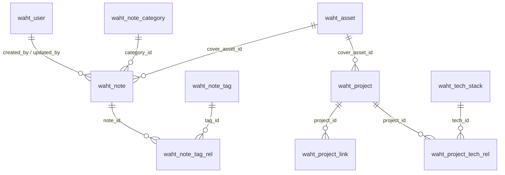

# WAHT 项目全量盘点

盘点日期：2026-08-23

本文档以当前仓库文件、Maven 依赖树、npm 安装结果、MySQL `information_schema` 和本地 `waht` 数据库只读查询为依据。它用于重新规划前建立事实基线，不把 README 中的未来设想当作已实现功能。

## 状态定义

- `已实现`：存在可运行代码，并且已经接入当前主工程。
- `部分实现`：存在表、页面或查询接口，但没有形成完整管理闭环。
- `静态占位`：有页面或目录，但内容是写死数据或仅有说明文档。
- `未来规划`：仓库只保留 README，没有对应运行代码或配置。
- `历史记录`：记录某次开发过程，不作为当前功能说明。

## 结论摘要

WAHT 当前是一个 Java 单体后端、React 单页前端和 MySQL 数据库组成的个人学习平台 MVP。

已形成闭环的业务：

1. 用户注册、登录、JWT 鉴权和登录状态恢复。
2. 公开笔记分页、搜索、分类标签筛选和详情阅读。
3. 当前用户笔记的新建、读取、更新、删除、发布和撤回。
4. Markdown 编辑、预览、快捷键、全屏和本地草稿恢复。
5. 项目与技术栈的公开列表、详情查询。

尚未形成闭环的业务：

1. 分类、标签、项目和技术栈只有公开查询，没有维护接口。
2. 素材只有数据库表和静态说明页，没有 Java 实体、Mapper、Service、Controller 和前端 API。
3. 首页、游戏科普、素材展示仍包含静态数据。
4. Go、AI、Redis、独立管理后台、Docker、Nginx、Kubernetes 和 CI 都没有实现。
5. 数据库迁移依靠手动 SQL，没有接入 Flyway 或 Liquibase。

## 真实仓库结构

```text
WAHT/
├─ .agents/                         仓库协作说明
├─ .editorconfig                    编辑器编码和缩进规则
├─ .gitattributes                   Git 换行符与文本规则
├─ .gitignore                       构建产物和本地文件忽略规则
├─ assets/                          素材政策和未来素材分类，当前主要是 README
├─ backend/
│  ├─ waht-java/                    已实现的 Spring Boot 主后端
│  ├─ waht-go/                      未来规划，仅 README
│  └─ ai-service/                   未来规划，仅 README
├─ database/
│  ├─ mysql/                        已实现的初始化和手动迁移 SQL
│  ├─ redis/                        未来规划，仅 README
│  └─ schema-design.md              MySQL 逻辑设计草稿
├─ design/                          未来 UI 设计资料目录，仅 README
├─ docs/                            架构、规则、决策、运行手册和开发记录
├─ frontend/
│  ├─ waht-web/                     已实现的 React 前台与个人写作台
│  └─ waht-admin/                   未来独立后台，仅 README
├─ infra/                           部署规划目录，目前没有可执行部署配置
├─ scripts/                         Windows 本地检查、启动和构建脚本
├─ temp/                            本地临时目录说明
└─ tools/                           未来工具目录说明
```

当前没有 Dockerfile、Docker Compose、Nginx 配置、Kubernetes YAML、GitHub Actions CI 或 Maven Wrapper。

## 后端盘点

### 构建与入口

- 工程：`backend/waht-java`
- 构建工具：系统 Maven，项目未提供 Maven Wrapper。
- Java：17。
- Spring Boot：3.3.5。
- 入口：`WahtJavaApplication.java`。
- 默认端口：8080，可由 `WAHT_SERVER_PORT` 覆盖。
- 主数据库：MySQL `waht`。
- 数据访问：MyBatis-Plus `BaseMapper`、Wrapper 和少量注解 SQL。
- Mapper XML 数量：0，虽然 `application.yml` 保留了 XML 扫描配置。

### Java 包结构

| 包 | 文件数 | 实际职责 |
| --- | ---: | --- |
| `common.api` | 2 | `BaseResponse` 和 `PageResponse` 统一响应模型 |
| `common.exception` | 3 | `ErrorCode`、`ServiceException` 和全局异常处理 |
| `common.model` | 1 | 笔记状态枚举 |
| `common.security` | 8 | JWT、当前用户、拦截器和参数解析器 |
| `common.web` | 1 | `X-Request-Id` 请求编号过滤器 |
| `config` | 4 | CORS、Web MVC、密码编码器和 MyBatis-Plus 配置 |
| `controller` | 8 | 认证、健康、笔记、分类、标签、项目和技术栈接口 |
| `dto` | 4 | 登录、注册、笔记保存和公开笔记查询参数 |
| `entity` | 9 | 除素材表外的 MySQL 实体 |
| `mapper` | 9 | 除素材表外的数据访问接口 |
| `service` | 3 | `AuthService`、`NoteService`、`ProjectService` |
| `vo` | 12 | 面向前端的登录、用户、笔记和项目响应模型 |

后端主源码共 65 个 Java 类型文件，业务分层是 `Controller -> Service -> Mapper -> MySQL`，没有额外 Repository 层。

### API 清单

所有业务响应都使用 `BaseResponse<T>`，业务异常通过 `ServiceException` 进入 `GlobalExceptionHandler`。

| 方法 | 路径 | 鉴权 | 状态 | 用途 |
| --- | --- | --- | --- | --- |
| `POST` | `/api/auth/login` | 否 | 已实现 | 登录并签发 JWT |
| `POST` | `/api/auth/register` | 否 | 已实现 | 注册并签发 JWT |
| `GET` | `/api/auth/me` | 是 | 已实现 | 恢复当前登录用户 |
| `GET` | `/api/health` | 否 | 已实现 | 应用级健康检查 |
| `GET` | `/api/notes` | 否 | 已实现 | 已发布笔记分页与组合筛选 |
| `GET` | `/api/notes/{slug}` | 否 | 已实现 | 已发布笔记详情并增加浏览量 |
| `GET` | `/api/note-categories` | 否 | 已实现 | 查询有效分类 |
| `GET` | `/api/note-tags` | 否 | 已实现 | 查询有效标签 |
| `GET` | `/api/my/notes` | 是 | 已实现 | 当前用户笔记列表 |
| `GET` | `/api/my/notes/{noteId}` | 是 | 已实现 | 当前用户笔记编辑详情 |
| `POST` | `/api/my/notes` | 是 | 已实现 | 新建草稿 |
| `PUT` | `/api/my/notes/{noteId}` | 是 | 已实现 | 更新自己的笔记 |
| `POST` | `/api/my/notes/{noteId}/publish` | 是 | 已实现 | 发布自己的笔记 |
| `POST` | `/api/my/notes/{noteId}/draft` | 是 | 已实现 | 撤回为草稿 |
| `DELETE` | `/api/my/notes/{noteId}` | 是 | 已实现 | 删除自己的笔记 |
| `GET` | `/api/projects` | 否 | 已实现 | 已发布项目列表 |
| `GET` | `/api/projects/{slug}` | 否 | 已实现 | 已发布项目详情 |
| `GET` | `/api/tech-stacks` | 否 | 已实现 | 有效技术栈列表 |

另外，Actuator 暴露 `health` 和 `info` 端点。没有分类、标签、项目、技术栈或素材的新增、修改、删除接口。

### 认证链路

```text
Authorization: Bearer token
  -> JwtAuthInterceptor 校验 JWT 签名和有效期
  -> UserMapper 查询 waht_user
  -> 确认用户存在且 status=ACTIVE
  -> CurrentUserArgumentResolver 注入 @LoginUser 参数
  -> Controller 和 Service 按 userId 限定私有笔记
```

项目只引入 `spring-security-crypto` 处理 BCrypt，没有引入完整的 `spring-boot-starter-security`。Web 鉴权是项目自定义 Spring MVC 拦截器，不是 Spring Security Filter Chain。

### 后端直接依赖

| 依赖 | 实际版本 | 作用 |
| --- | --- | --- |
| `spring-boot-starter-web` | 3.3.5 | Spring MVC、JSON 和内嵌 Tomcat |
| `spring-boot-starter-validation` | 3.3.5 | Jakarta Bean Validation |
| `spring-boot-starter-actuator` | 3.3.5 | 健康与应用信息端点 |
| `mybatis-plus-spring-boot3-starter` | 3.5.7 | Mapper、Wrapper、分页和 JDBC 集成 |
| `spring-security-crypto` | 6.3.4 | BCrypt 密码哈希 |
| `mysql-connector-j` | 8.3.0 | MySQL JDBC 驱动，运行时依赖 |
| `spring-boot-starter-test` | 3.3.5 | JUnit、Mockito、Spring Test，测试依赖 |

主要传递依赖包括 Spring Framework 6.1.14、Tomcat 10.1.31、Jackson 2.17.2、HikariCP 5.1.0、MyBatis 3.5.16、Hibernate Validator 8.0.1.Final、Micrometer 1.13.6 和 Logback 1.5.11。

### 后端配置

| 环境变量 | 默认值 | 用途 |
| --- | --- | --- |
| `WAHT_SERVER_PORT` | `8080` | 服务端口 |
| `WAHT_DB_URL` | 本机 3306 的 `waht` | JDBC 地址 |
| `WAHT_DB_USERNAME` | `root` | 数据库用户 |
| `WAHT_DB_PASSWORD` | 空 | 数据库密码，实际运行必须配置 |
| `WAHT_CORS_ALLOWED_ORIGINS` | 本机 5173 两种地址 | CORS 白名单 |
| `WAHT_JWT_SECRET` | 本地开发默认值 | JWT 签名秘密，部署前必须替换 |
| `WAHT_JWT_EXPIRATION_MINUTES` | `120` | JWT 有效时间 |

HikariCP 当前配置为最小空闲连接 1、最大连接数 10、连接超时 10 秒。健康探针已启用，日志包含 `requestId`。

### 后端测试

当前有 6 个测试类：

- `WahtJavaApplicationTests`
- `JwtTokenProviderTests`
- `RequestIdFilterTests`
- `NoteSaveRequestValidationTests`
- `AuthServiceTests`
- `NoteServiceTests`

测试主要覆盖启动、JWT、请求编号、DTO 校验、认证服务和笔记服务。项目没有 Testcontainers 或基于真实 MySQL 的自动集成测试套件。

2026-08-23 重新执行 `scripts/verify-project.ps1`：Maven 共 13 个测试通过，TypeScript 类型检查和 Vite 生产构建通过。

## 前端盘点

### 构建与入口

- 工程：`frontend/waht-web`
- React：18.3.1。
- TypeScript：严格模式，禁止隐式 `any`。
- Vite：开发端口固定 5173，端口占用时直接失败。
- API 默认使用 `/api`，由 Vite 代理到 `http://localhost:8080`。
- 入口链路：`main.tsx -> App.tsx -> router.tsx -> AppLayout/页面`。
- 状态和请求缓存：TanStack Query。
- 登录状态：React Context 加 `localStorage` JWT。
- 样式：Tailwind CSS 3 和全局 CSS。
- 前端测试：没有测试依赖、测试脚本或测试文件。

### 前端源码结构

| 目录 | 实际文件 |
| --- | --- |
| `api` | `http.ts`、`auth.ts`、`notes.ts`、`projects.ts` |
| `app` | 应用组件、全局错误边界、路由 |
| `components` | Markdown 渲染器、Markdown 编辑器、区块标题 |
| `features/auth` | 登录状态 Provider、受保护路由 |
| `layouts` | 全站布局和导航 |
| `pages` | 12 个页面组件 |
| `types` | 与后端响应对应的 TypeScript 类型 |
| `utils` | 日期、错误消息和本地草稿工具 |
| `styles` | Tailwind 基础层和项目全局样式 |
| `assets` | 原创二次元登录背景 `plum-spirit-login.jpg` |

### 前端路由

| 路径 | 页面 | 状态 | 数据来源 |
| --- | --- | --- | --- |
| `/` | 首页 | 部分实现 | 当前状态和最近笔记仍为静态数组 |
| `/login` | 登录 | 已实现 | `/api/auth/login` |
| `/register` | 注册 | 已实现 | `/api/auth/register` |
| `/notes` | 公开笔记 | 已实现 | `/api/notes`、分类和标签接口 |
| `/notes/:slug` | 笔记详情 | 已实现 | `/api/notes/{slug}` |
| `/workspace/notes` | 我的笔记 | 已实现，受保护 | `/api/my/notes` |
| `/workspace/notes/new` | 新建笔记 | 已实现，受保护 | `/api/my/notes` |
| `/workspace/notes/:noteId/edit` | 编辑笔记 | 已实现，受保护 | `/api/my/notes/{noteId}` |
| `/projects` | 项目列表 | 已实现 | `/api/projects` |
| `/projects/:slug` | 项目详情 | 已实现 | `/api/projects/{slug}` |
| `/games` | 游戏科普 | 静态占位 | 写死的三个主题 |
| `/assets` | 素材展示 | 静态占位 | 写死的三条素材规则 |
| `*` | 404 | 已实现 | 无接口 |

### 前端运行依赖

下表同时记录 `package.json` 声明范围和当前 `node_modules` 实际安装版本。

| 依赖 | 声明 | 已安装 | 作用 |
| --- | --- | --- | --- |
| `react` | `^18.3.1` | 18.3.1 | UI 组件运行时 |
| `react-dom` | `^18.3.1` | 18.3.1 | 浏览器渲染 |
| `react-router-dom` | `^6.28.1` | 6.30.4 | 页面路由与导航 |
| `@tanstack/react-query` | `^5.62.7` | 5.101.2 | 服务端状态、缓存和请求生命周期 |
| `react-markdown` | `^10.1.0` | 10.1.0 | Markdown 渲染 |
| `remark-gfm` | `^4.0.1` | 4.0.1 | 表格、删除线等 GFM 扩展 |
| `lucide-react` | `^0.468.0` | 0.468.0 | 页面图标 |

### 前端开发依赖

| 依赖 | 声明 | 已安装 | 作用 |
| --- | --- | --- | --- |
| `typescript` | `^5.7.2` | 5.9.3 | 类型检查 |
| `vite` | `^6.0.3` | 6.4.3 | 开发服务器和生产构建 |
| `@vitejs/plugin-react` | `^4.3.4` | 4.7.0 | React JSX 和 Fast Refresh |
| `tailwindcss` | `^3.4.17` | 3.4.19 | 原子化 CSS |
| `postcss` | `^8.4.49` | 8.5.16 | CSS 处理 |
| `autoprefixer` | `^10.4.20` | 10.5.2 | 浏览器前缀 |
| `@types/react` | `^18.3.12` | 18.3.31 | React 类型 |
| `@types/react-dom` | `^18.3.1` | 18.3.7 | React DOM 类型 |
| `@types/node` | `^22.10.2` | 22.20.0 | Vite 配置中的 Node 类型 |

## 数据库盘点

### 数据库事实

- 数据库：本机 MySQL `waht`。
- 表数量：10。
- 引擎：全部 InnoDB。
- 排序规则：全部 `utf8mb4_unicode_ci`。
- 物理外键数量：0，当前全部使用逻辑外键。
- 初始化方式：手动依次执行编号 SQL。
- 迁移方式：手动执行 `migration` 目录中的增量 SQL。
- 当前没有 Flyway、Liquibase 或数据库版本表。

以下记录数来自 2026-08-23 的本机数据库精确 `COUNT(*)`，本地数据变化后会失效。

### 逻辑关系



图中关系都是应用约定，不是 MySQL `FOREIGN KEY`。

### 表结构与实现状态

| 表 | 字段 | 主要索引 | 本地记录 | Java 实现状态 |
| --- | --- | --- | ---: | --- |
| `waht_user` | `id`、`username`、`password`、`nickname`、`avatar_url`、`role`、`status`、`last_login_at`、`created_at`、`updated_at` | 用户名唯一；状态索引 | 1 | 实体、Mapper、认证 Service 和接口已实现 |
| `waht_note_category` | `id`、`name`、`slug`、`description`、`sort_order`、`status`、时间字段 | slug 唯一；状态与排序联合索引 | 3 | 实体、Mapper、有效分类查询已实现；维护接口缺失 |
| `waht_note_tag` | `id`、`name`、`slug`、`color`、`status`、时间字段 | slug 唯一；状态索引 | 4 | 实体、Mapper、有效标签查询已实现；维护接口缺失 |
| `waht_asset` | `id`、名称、类型、存储路径、缩略图、扩展名、大小、来源、授权、公开状态、时间字段 | 类型、来源、公开状态索引 | 0 | 只有表；没有实体、Mapper、Service、Controller 或前端 API |
| `waht_note` | `id`、标题、slug、摘要、Markdown 正文、分类、封面、状态、浏览量、发布时间、作者、时间字段 | slug 唯一；分类、状态发布时间、封面、作者索引 | 3 | 公开阅读和作者 CRUD 已实现 |
| `waht_note_tag_rel` | `note_id`、`tag_id`、`created_at` | 联合主键；tag 索引 | 4 | 实体、Mapper 和笔记保存关联已实现 |
| `waht_project` | `id`、名称、slug、摘要、Markdown 详情、封面、状态、排序、起止日期、时间字段 | slug 唯一；状态排序、封面索引 | 2 | 实体、Mapper 和公开查询已实现；管理接口缺失 |
| `waht_project_link` | `id`、`project_id`、类型、标题、URL、排序、时间字段 | project、类型索引 | 4 | 实体、Mapper 和项目详情查询已实现；管理接口缺失 |
| `waht_tech_stack` | `id`、名称、slug、类型、图标、排序、状态、时间字段 | slug 唯一；类型、状态索引 | 8 | 实体、Mapper 和公开查询已实现；管理接口缺失 |
| `waht_project_tech_rel` | `project_id`、`tech_id`、`created_at` | 联合主键；tech 索引 | 8 | 实体、Mapper 和项目详情查询已实现 |

### SQL 文件

| 文件 | 用途 |
| --- | --- |
| `database/mysql/init/001_init_schema.sql` | 创建 `waht` 数据库和 10 张表 |
| `database/mysql/init/002_init_admin_user.sql` | 初始化本地管理员记录 |
| `database/mysql/init/003_init_note_demo_data.sql` | 初始化分类、标签和三篇演示笔记 |
| `database/mysql/init/004_init_project_demo_data.sql` | 初始化技术栈、两个项目、链接和关联数据 |
| `database/mysql/migration/20260711_001_repair_note_demo_utf8.sql` | 修复早期演示数据的中文编码 |

注意：`database/schema-design.md` 写着“不生成 SQL”，但 SQL 已经存在并运行。当前数据库事实应以 `001_init_schema.sql` 和实际 MySQL 结构为准。

## 本地脚本盘点

| 文件 | 用途 |
| --- | --- |
| `scripts/check-local.ps1` | 检查 Java、Maven、Node、npm、数据库密码环境变量和 MySQL 连接 |
| `scripts/start-backend.ps1` | 检查环境后启动 Spring Boot |
| `scripts/start-frontend.ps1` | 安装依赖并启动 Vite 前端 |
| `scripts/verify-project.ps1` | 执行后端 Maven 测试和前端生产构建 |

## 现有文档全量清单

新增本文档前，扫描结果为 47 份 Markdown 文档。当前 Git 状态中 44 份已跟踪，3 份 Day Log 仍未跟踪；另外多份已跟踪文档存在未提交修改。

### 根目录与总览

| 文档 | 状态 | 用途 |
| --- | --- | --- |
| `README.md` | 当前总览 | 项目定位、能力、入口和边界 |

### docs 核心文档与历史记录

| 文档 | 状态 | 用途 |
| --- | --- | --- |
| `docs/architecture.md` | 部分过时 | 单体架构、认证和笔记链路；图中 Redis、MinIO 尚未实现 |
| `docs/cloud-native.md` | 学习规划 | 记录暂缓 Docker/K8s 和后续学习顺序 |
| `docs/dev-rules.md` | 当前规则 | 统一响应、异常、注释、测试和阶段边界 |
| `docs/directory-rules.md` | 当前规则 | 规定各类文件的存放位置 |
| `docs/frontend-design.md` | 当前设计加未来规划 | 已实现前端、接口约定、写作台和登录视觉，同时包含未实现后台与素材页面设想 |
| `docs/game-dev-notes.md` | 学习规划 | 游戏开发能力地图和未来内容方向 |
| `docs/module-plan.md` | 当前进度 | 各模块已完成项和素材模块待办 |
| `docs/project-decisions.md` | 当前决策 | D001 至 D011 的技术与产品决策 |
| `docs/roadmap.md` | 部分历史化 | 原 Day 1 至 Day 4 计划和当前后续建议 |
| `docs/runbook-local.md` | 当前运行手册 | Windows 环境、MySQL 初始化、前后端启动、验证和排错 |
| `docs/day-log/2026-06-26-day-1.md` | 历史记录 | 初始目录、规则和阶段边界 |
| `docs/day-log/2026-07-11-day-2.md` | 历史记录，未跟踪 | 统一响应、异常和首轮验证 |
| `docs/day-log/2026-08-08-day-3.md` | 历史记录，未跟踪 | CORS、请求编号、笔记工作台和工程化增强 |
| `docs/day-log/2026-08-12-day-4.md` | 历史记录，未跟踪 | Markdown 编辑器、草稿恢复、登录视觉和 MySQL CRUD 验证 |

### 后端文档

| 文档 | 状态 | 用途 |
| --- | --- | --- |
| `backend/README.md` | 当前目录说明 | Java 主线以及 Go、AI 预留目录 |
| `backend/waht-java/README.md` | 当前后端手册 | 工程能力、配置、命令、接口和阶段边界 |
| `backend/waht-go/README.md` | 未来规划 | Go 排行榜、实时服务等设想，没有代码 |
| `backend/ai-service/README.md` | 未来规划 | AI 助手服务设想，没有代码 |

### 前端文档

| 文档 | 状态 | 用途 |
| --- | --- | --- |
| `frontend/README.md` | 当前目录说明 | Web 前台和未来 Admin 的边界 |
| `frontend/waht-web/README.md` | 当前前端手册 | 技术栈、启动、登录联调、编辑器和视觉说明 |
| `frontend/waht-admin/README.md` | 未来规划 | 独立管理后台设想，没有工程代码 |

### 数据库文档

| 文档 | 状态 | 用途 |
| --- | --- | --- |
| `database/README.md` | 当前目录说明 | MySQL 与未来 Redis 的目录边界 |
| `database/schema-design.md` | 设计基本一致，标题过时 | 10 张表的逻辑设计；“不生成 SQL”表述已失效 |
| `database/mysql/README.md` | 当前规则 | MySQL 目录、执行顺序和 utf8mb4 要求 |
| `database/mysql/init/README.md` | 当前清单 | 4 个初始化脚本说明 |
| `database/mysql/migration/README.md` | 当前清单 | 手动迁移规则和现有修复脚本 |
| `database/redis/README.md` | 未来规划 | 缓存、验证码、排行榜设想，没有 Redis 代码或配置 |

### 素材文档

| 文档 | 状态 | 用途 |
| --- | --- | --- |
| `assets/README.md` | 当前目录说明 | 素材分类和管理边界 |
| `assets/asset-policy.md` | 当前规则 | 来源、授权、公开状态和 Git 提交规则 |
| `assets/hutao-theme/README.md` | 本地主题规则 | 暖红梅花方向及版权边界 |
| `assets/drawings/README.md` | 未来内容目录 | 自己的板绘练习记录规则 |
| `assets/models/README.md` | 未来内容目录 | 3D 建模练习与存放规则 |
| `assets/fan-reference/README.md` | 本地参考 | 网络同人素材只做本地参考 |
| `assets/official-reference/README.md` | 本地参考 | 官方素材只做本地参考 |
| `assets/generated/README.md` | 未来整理 | AI 生成素材目录规则 |
| `assets/original/README.md` | 未来整理 | 原创素材目录规则 |
| `assets/public-safe/README.md` | 未来整理 | 可公开素材审核后的存放规则 |

当前真正被前端使用的登录背景位于 `frontend/waht-web/src/assets/plum-spirit-login.jpg`，不在根 `assets/generated` 目录中。

### 基础设施、设计和工具文档

| 文档 | 状态 | 用途 |
| --- | --- | --- |
| `infra/README.md` | 当前目录说明 | 本地和未来部署目录边界 |
| `infra/local/README.md` | 当前入口 | 指向本地运行说明和脚本 |
| `infra/docker/README.md` | 未来规划 | 没有 Dockerfile 或 Compose |
| `infra/nginx/README.md` | 未来规划 | 没有 Nginx 配置 |
| `infra/k8s/README.md` | 未来规划 | 没有 Kubernetes YAML |
| `design/README.md` | 未来规划 | UI 参考、线框图和主题规范目录 |
| `scripts/README.md` | 当前清单 | 四个 Windows 脚本的说明和命令 |
| `temp/README.md` | 本地目录规则 | 临时文件使用边界 |
| `tools/README.md` | 未来规划 | 数据修复、素材检查等工具设想 |

## 文档与代码偏差

1. `docs/architecture.md` 把 Redis 和 MinIO 画进第一阶段或当前架构，但仓库没有依赖、配置或代码，应改成未来边界。
2. `database/schema-design.md` 仍标记 V0.1 且写着“不生成 SQL”，实际已有 10 张表和运行数据。
3. `docs/frontend-design.md` 同时包含已实现页面和未来 `waht-admin` 设想，重新规划时需要分开维护。
4. 首页文案看起来像动态工作台，但当前数据是静态数组。
5. 游戏与素材页面已经有路由，但不是业务模块，只是静态占位。
6. `waht_asset` 已建表，但后端没有对应 Java 类型；`AssetsPage` 也没有请求数据库。
7. 项目演示 SQL 中部分“下一步”文字仍描述早期状态，不等于当前真实进度。
8. 47 份文档分散在多个目录，存在重复描述；后续应确定少数事实源，其余文档只负责专题或历史记录。

## 重新规划时建议保留的事实源

建议后续只把以下文档作为持续维护的主文档：

1. `README.md`：产品定位和快速入口。
2. `docs/project-inventory.md`：当前真实结构和实现边界。
3. `docs/architecture.md`：只描述当前架构和明确的下一阶段架构。
4. `docs/module-plan.md`：功能完成状态和下一阶段范围。
5. `docs/project-decisions.md`：不可随意变化的技术决策。
6. `docs/runbook-local.md`：可执行的本地运行步骤。
7. `database/mysql/init/001_init_schema.sql`：数据库从零初始化事实源。
8. `database/mysql/migration/`：已有数据库的增量事实源。

Day Log 只保留历史，不再回改成当前状态；目录 README 只描述目录职责，不重复维护业务进度。

## 当前最需要处理的工程问题

1. 当前工作树有大量未提交源码和文档，先审查并建立 Git 基线，否则后续无法可靠区分新规划带来的改动。
2. 决定下一阶段是否先完成“内容管理闭环”，即分类、标签、项目、技术栈和素材管理。
3. 如果素材上传不是近期目标，应暂时移除架构中的 MinIO；如果是近期目标，再设计存储、元数据和权限边界。
4. 把首页、游戏和素材页面明确标记为静态占位，或者在下一阶段接入真实接口。
5. 在公开部署前替换默认 JWT secret，并重新评估 `localStorage` token 方案。
